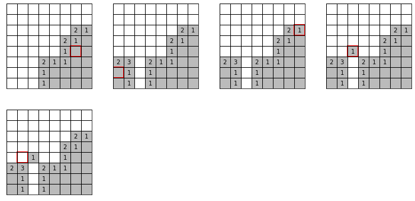

# Minesweeper gym environment

Simple Gym environment to play minesweeper.

## Installation

Let's create a simple conda environment to test this package:

```bash
conda create --name minesweeper-env -y -c conda-forge python=3.8 ipykernel
conda activate minesweeper-env
pip install -e .
```

Extra depencies used for the Reinforcement Learning notebooks can be installed
using (`--no-cache-dir` avoids out-of-memory problems installing torch):

```bash
pip --no-cache-dir install -r requirements.txt
```

## Useful links

* [Creating a Gym environment](https://github.com/openai/gym/blob/master/docs/creating-environments.md)

## How to use it

```python
import gym
import numpy as np
```

Play a single step:

```python
env = gym.make('gym_minesweeper:minesweeper-v0')
np.random.seed(42)

action = (4, 3)
env.step(action)
env.render(action=action)
```


    
Play a full (random) game, and show all the steps:

```python
env = gym.make('gym_minesweeper:minesweeper-v0')
np.random.seed(14)
env.action_space.np_random.seed(14)

for ax in env.render_grid(nrows=2, ncols=4):
    action = env.action_space.sample()
    _, _, done, _  = env.step(action)
    env.render(action, ax=ax)
    if done:
        break
```


